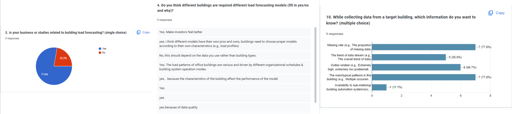

<h1>
<b>
BaiTest: A Platform for AI Evaluation in Smart Buildings
</b>
</h1>

> [Demo video](https://youtu.be/U8PfB93wCx0)

> [Meeting Note](https://docs.google.com/document/d/1PPSkh5ZNaXh1GiIWawdBqzbC4-HKz2NTu9-rDip23mg/edit )

> [Survey Link](https://forms.gle/e5ZKm39eXKEoAYRi9)

## :fire: Introduction
The goal of the BaiTest platform is to understand and deploy challenges related to AI-based building load forecasting models.
 
 
BaiTest can be used by building AI developers to compare
and select appropriate ML models. Our preliminary experiments show that a model with
high maintainability or reliability can show 3%-10% more energy saving against a model
with the highest accuracy. BaiTest can allow effective use of the large number of ML
models and accelerate ML model deployment; this can lead to tens of millions of saving.

## :heart: Analysis of ISO standard into our scenario
  Our goal is again to define what tests we shall apply to an ML model. We plan to design the evaluation methodology following the ISO/IEC 25010 [4, 5], a software quality standard. ISO25010 describes 13 characteristics consists of product quality and quality in use, for example, availability, reusability and efficiency, etc. In BaiTest, we plan to leverage a subset of characteristics as shown in the following table.
  We translate the ISO standard into the context of buildings, and we plan to test both (a) a building load forecasting ML model and (b) its associated energy control. We list the corresponding evaluation checklists in terms of buildings as shown in the right table.

  

## :star: Front-end design
* User-guider design
  

  

* Role selection and building selection/upload design
  

  

* Building data analysis design
  

  

* Building evaluation result display design
  

  
  

## 🍉 Get Start
* Back-end:
  1. Set up your databases in /setup_mysql.py(Make sure your mysql id ,password and database is right)
  2. Modify your mysql user, password and database in config.py
  3. Run run.py
* fornt-end:
  1. npm install
  2.Just run npm run dev in your terminal.

## :eyes: Survey result
 We cordially invite you to participate in the Survey on ML deployment in smart building:  https://forms.gle/e5ZKm39eXKEoAYRi9
* We designed a questionnaire to study (i) In practice, does building load forcasting model should be carefully selected among different buildings?(ii) When using the building load forcasting model, what metric of the model do they care about? To gain those information we deisnged four part question, i.e., ueser related, AI evaluation related, data related and model management related.
 

* The questionnaires include single choice, multiple choice and fill-in-the-blank questions. So we selected one question result in each type to present. From the results, we can conclude that (i) 77% of the interviewees' workes or studies are related to building load forecasting, (ii) 87.5% interviewees think  different buildings are required different load forcasting models. (iii) Most interviewees think the missing rate and the main pattern are the most important when they collect data from target building.

  

## :office: Dataset Introduction
We have processed three buildings governed by EMSD, i.e., WKGO, MKGO, YLDOB.
 
WKGO, MKGO, YLDOB are contain multiple chiller's to record their daily data, and WKGO has the highest number of chiller(6). The data of the three buildings are mainly included Supple Temperature, Return Temperature, Flow Rate, etc. The data range of MKGO and YLDOB is  2023, while the WKGO data ranges from 2019 to 2023.
 
In data preprocessing, because the time intervals between different data records different, so we make the time interval between data to 5 minutes.And for some outliers and missing data, we use 0 to fill in. In addition, we combined the existing data and formulas to calculate the coolingload and cop of each chiller. After preprocessing, WKGO has 380448 data records,MKGO has 18921 data records and YLDOB has 9258 data records.

## :muscle: Data augmentation design
The Data Augmentation module is primarily responsible for receiving user-selected data augmentation policies. Different policies, based on different algorithms, are applied to predict future data for buildings. Currently, there are four policies available: Work hour change, Equipment Aging, Long-term Temperature change, and Pandemic.
* Work Hour Increase/Decrease/Switch: Three common situations of working hours for people working in the building.
* Equipment Aging: The equipment supporting the building is gradually aging, such as chiller and sensors. 
*	Long-term Temperature Change: Long term slow rise in outdoor temperature. The implementation of this policy is based on a deep learning model that predicts the future temperature growth trend and uses the future temperature as input for the time series data prediction model to forecast building data.
*	Pandemic: Large scale infectious diseases, such as Covid.

## :orange_book: Building evaluation models
We re-implement five AI-based load forecasting models for evaluate our testing methodology. Three from AI competition and the other two from research community.
> [Global AI challenge Competition Link](https://www.globalaichallenge.com/en/competition/)

## :phone: Contact us
If you are interested in our project, you can contact us via email. The following are the contact information of each project creator.
  Marco yang2.deng@connect.polyu.hk
  Jingyun zly594931618@hkbu.edu.hk
  Donghua donghuaxie22612118@gmail.com
  Liang Rui maxwell.liang@connect.polyu.hk
  Jiaqi	jq898.fan@connect.polyu.hk
