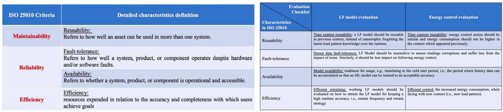
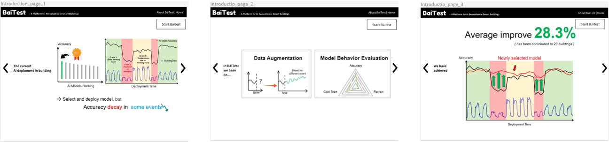
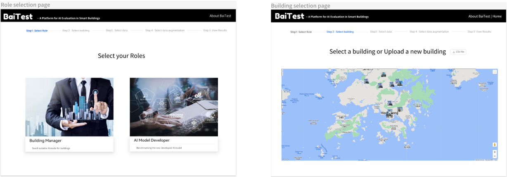
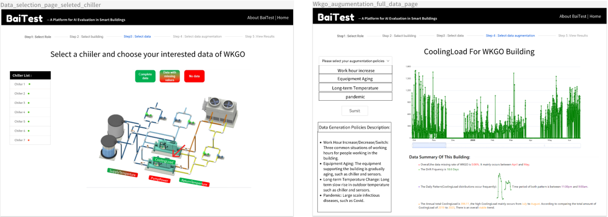
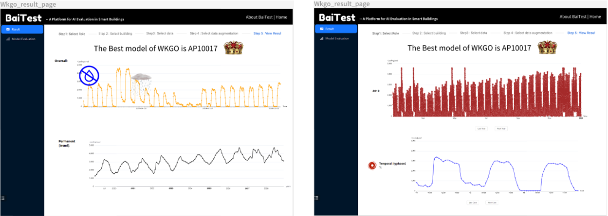
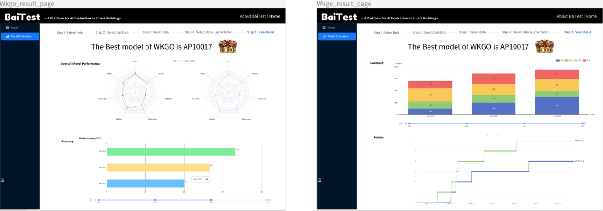

# Baitest-Building-Evaluation-System

<h1>
<b>
Baitest --A Building Evaluation System
</b>
</h1>

> [Demo video](https://youtu.be/U8PfB93wCx0)

> [Meeting Note](https://docs.google.com/document/d/1PPSkh5ZNaXh1GiIWawdBqzbC4-HKz2NTu9-rDip23mg/edit )

> [Survey Link](https://forms.gle/e5ZKm39eXKEoAYRi9)

## :fire: Introduction
The goal of the BaiTest platform is to understand and deploy challenges related to AI-based building load forecasting models.

## :heart: Analysis of ISO standard into our scenario
  Our goal is again to define what tests we shall apply to an ML model. We plan to design the evaluation methodology following the ISO/IEC 25010 [4, 5], a software quality standard. ISO25010 describes 13 characteristics consists of product quality and quality in use, for example, availability, reusability and efficiency, etc. In BaiTest, we plan to leverage a subset of characteristics as shown in the following table.
  We translate the ISO standard into the context of buildings, and we plan to test both (a) a building load forecasting ML model and (b) its associated energy control. We list the corresponding evaluation checklists in terms of buildings as shown in the right table.

  

## :star: Front-end design
* User-guider design

  

* Role selection and building selection/upload design

  

* Building data analysis design

  

* Building evaluation result display design

  
  

## :eyes: Back-end design
