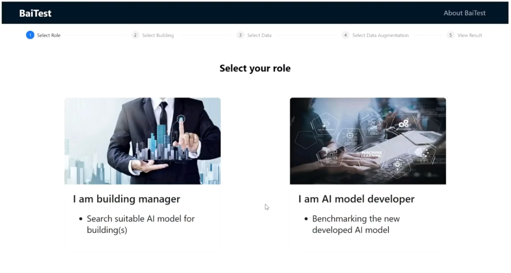

# Baitest-Building-Evaluation-System

<h1>
<b>
Baitest --A Building Evaluation System
</b>
</h1>

> [Demo video](https://youtu.be/U8PfB93wCx0)

> [Meeting Note](https://docs.google.com/document/d/1PPSkh5ZNaXh1GiIWawdBqzbC4-HKz2NTu9-rDip23mg/edit )

> [Survey Link](https://forms.gle/e5ZKm39eXKEoAYRi9)

## Introduction
The goal of the BaiTest platform is to understand and deploy challenges related to AI-based building load forecasting models.
  
## Front-end design
* User-guider design 
* Role selection and building selection/upload design
* Data analysis design
* Web display design
  
## Back-end design
